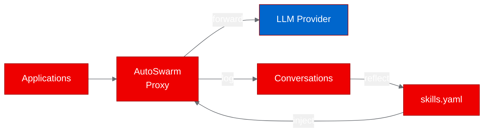

# Deploying a self-improving LLM proxy on Red Hat OpenShift: a PoC with AutoSwarm

## The skill gap in LLM operations

Every time your team talks to a large language model (LLM), there is an opportunity to get better at it. Most proxy setups treat each request as a stateless transaction: route it, log it, forget it. AutoSwarm takes a different approach. It is an open-source, OpenAI-compatible proxy that logs every conversation, uses the LLM itself to extract reusable strategies, and injects those strategies into future prompts automatically.

We deployed AutoSwarm on Red Hat OpenShift using Universal Base Image (UBI) containers to validate whether this self-improving proxy pattern works in an enterprise Kubernetes environment.

## What AutoSwarm does

AutoSwarm runs as a FastAPI server between your applications and a local or cloud LLM provider (Ollama, vLLM, LM Studio, or any OpenAI-compatible endpoint). It exposes the standard /v1/chat/completions and /v1/models endpoints, so existing applications just change their base URL.

The interesting part is the "reflect" pass. After conversations accumulate, AutoSwarm uses the LLM to analyze them and extract "skills": reusable strategies stored in a YAML file. These skills get injected into future system prompts automatically, and bad skills are pruned over time. The result is a proxy that gets better at its job the more you use it.

## Containerizing for OpenShift

AutoSwarm is a pure Python project with 5 runtime dependencies (FastAPI, Uvicorn, httpx, Click, PyYAML). We containerized it using the ubi9/python-312 base image.

3 build attempts were needed due to packaging and permission issues:

The first build failed because the project uses hatchling as its build system, and hatchling requires README.md during metadata generation. Our .dockerignore excluded all markdown files, breaking the pip install step. We fixed this by keeping README.md in the build context.

The second build failed on OpenShift file permissions. The chgrp command could not change group ownership on files copied by the COPY directive because the UBI Python image defaults to UID 1001, which does not have permission to change groups. The fix was switching to USER 0 for all build operations, then setting group-0 permissions before switching back to USER 1001.

The third build succeeded, producing a 320 MB image with all dependencies installed and Uvicorn configured to listen on port 8080.

One important detail: AutoSwarm's CLI (`autoswarm start`) tries to auto-detect local LLM servers on common ports before starting. In a container, this detection fails and the process exits. We bypassed this by starting the FastAPI app directly with Uvicorn, skipping the CLI detection logic.

## Deploying and testing

The deployment uses a single Deployment with a ClusterIP Service on port 8080. Resources are minimal: 256 Mi memory, 250 m CPU.

We ran 3 test scenarios:

| Scenario | Endpoint | Result | Details |
|----------|----------|--------|---------|
| Server startup | GET /docs | Pass | FastAPI OpenAPI documentation loads correctly |
| Models listing | GET /v1/models | Pass | Returns 502 with JSON error (correct behavior without upstream) |
| Chat completions | POST /v1/chat/completions | Partial | Returns 500 instead of 502 (endpoint exists but lacks error handling for missing upstream) |

The /v1/models endpoint correctly catches the upstream connection error and returns a clean 502 with a JSON error message. The /v1/chat/completions endpoint hits the same connection error but does not have matching error handling, resulting in a raw 500. This is a code quality issue in the original project, not a deployment problem: the route exists, accepts the right request format, and would function normally with a connected upstream.

## What we learned

**Build system metadata matters.** Hatchling validates that README.md exists before building the wheel. When containerizing Python projects that use hatchling, include all files referenced in pyproject.toml, even if they seem like documentation-only files.

**CLI auto-detection is anti-container.** Tools that probe localhost for services (LM Studio on :1234, Ollama on :11434) will fail in containers where those services are not co-located. The workaround is bypassing the CLI and calling the library code directly.

**Error handling across endpoints should be consistent.** When one endpoint handles upstream failures gracefully (returning 502) but another does not (returning 500), it creates confusing behavior. This is a common issue in proxy applications and worth fixing upstream.

## Try it yourself

The deployment artifacts are in the [autoswarm fork](https://github.com/aicatalyst-team/autoswarm):

- Dockerfile.ubi for UBI-based containerization
- kubernetes/ directory with Deployment and Service manifests

To demonstrate the full self-improving behavior, deploy an Ollama or vLLM instance alongside AutoSwarm and configure the UPSTREAM_URL environment variable. The skill injection and reflection features require a functioning upstream LLM to produce meaningful results.

Learn more about deploying AI inference services on [Red Hat OpenShift AI](https://www.redhat.com/en/technologies/cloud-computing/openshift/openshift-ai).
